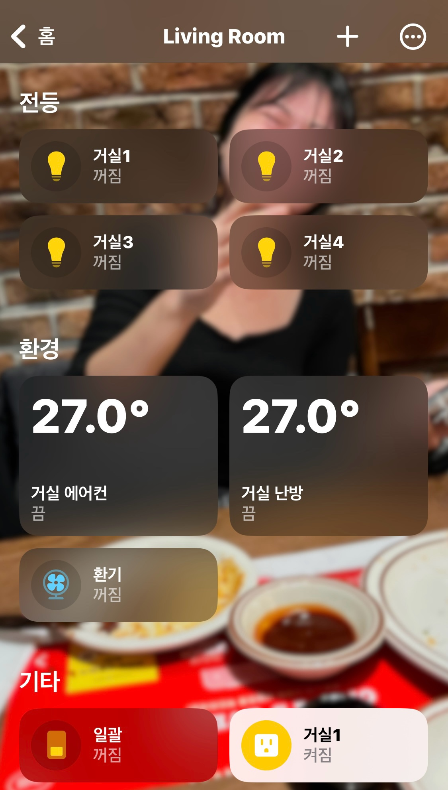

# homebridge-hiot-autoever

[](https://github.com/ywkim/homebridge-hiot-autoever/actions/workflows/ci.yml)
[](https://nodejs.org/)
[](https://homebridge.io/)
[](./LICENSE)

**Hi-oT(현대오토에버) KOCOM 월패드를 쓰는 한국 아파트의 조명·콘센트·에어컨·환기·난방·가스밸브를 Apple HomeKit과 Siri로 제어.**

힐스테이트, 올림픽파크포레온 등 Hi-oT 클라우드(`https://home.hiot.autoever.com`)에 연결된 단지에서, 월패드를 그대로 둔 채 Homebridge를 통해 HomeKit으로 미러링합니다.

<p align="center">
  
</p>

> ⚠️ **비공식 커뮤니티 플러그인** — 현대오토에버·Hi-oT·KOCOM과 무관합니다. 단지·펌웨어별 동작 차이가 있을 수 있으며, 사용에 따른 책임은 사용자 본인이 집니다.

---

## 이걸로 뭐가 되나요

- 🗣️ **Siri 음성 제어** — "헤이 시리, 거실 불 꺼줘", "에어컨 24도로 맞춰줘"
- 🏠 **HomeKit 자동화** — "내가 집에 도착하면 거실 조명 켜고 환기 끄기", "잠들 때 일괄소등"
- 📱 **iPhone·iPad·Apple Watch·Mac 어디서나** Hi-oT 앱 없이도 한 화면에서 제어
- 🌡️ **온도·상태 한 눈에** — 난방 현재온도, 가스밸브 잠금 여부 등이 위젯·잠금화면에 노출

## 지원 디바이스

[`src/accessories/registry.ts`](./src/accessories/registry.ts) 기준 — Hi-oT 앱이 노출하는 것 중 현재 미러링된 동작만 표기.

| 코드  | Hi-oT 명칭 | HomeKit 서비스   | 지원 동작                                                 |
| ----- | ---------- | ---------------- | --------------------------------------------------------- |
| `LGT` | 조명       | Lightbulb        | 켜기/끄기 (디밍·색온도 미지원)                            |
| `WSK` | 콘센트     | Outlet           | 켜기/끄기                                                 |
| `SWT` | 스위치     | Switch           | 켜기/끄기                                                 |
| `ACB` | 에어컨     | HeaterCooler     | 켜기/끄기, 현재온도 표시, 냉방 목표온도 18~30 °C (1 °C 단위) |
| `VNT` | 환기       | Fan v2           | 켜기/끄기 (팬속도 미지원)                                 |
| `HTR` | 난방       | Thermostat       | 난방/끄기, 현재온도 표시, 목표온도 15~30 °C (1 °C 단위)   |
| `GDK` | 가스밸브   | LockMechanism    | 잠금 상태 **읽기 전용** — 안전상 HomeKit에서 unlock 불가  |

> **가스밸브 unlock이 안 되는 이유**: Hi-oT 앱과 백엔드가 모바일에서의 가스밸브 open을 거부합니다(`lock='on'` set 요청 차단). 본 플러그인도 같은 안전 정책을 따라 HomeKit unlock 버튼을 비활성화합니다. 가스밸브를 열려면 주방 벽패드나 수동 레버를 사용하세요.

엘리베이터 호출·일괄소등·디밍 등은 [ROADMAP](./ROADMAP.md)에서 추적합니다. Hi-oT 앱이 노출하는 모든 기능을 1:1 미러링하는 것이 목표이므로, **빠진 디바이스 타입이 있다면 [Issue](https://github.com/ywkim/homebridge-hiot-autoever/issues/new?template=device_report.yml)로 알려주세요.**

## Hi-oT 앱 vs HomeKit으로 옮기면

| 항목              | Hi-oT 앱                  | 본 플러그인 + HomeKit                         |
| ----------------- | ------------------------- | --------------------------------------------- |
| 음성 제어         | ❌                         | ✅ Siri (한국어 가능)                          |
| 자동화 트리거     | 시간·간단 조건만           | ✅ 위치·일출/일몰·센서·다른 액세서리 상태 조합 |
| 위젯·잠금화면     | ❌                         | ✅ iOS 위젯, 컨트롤센터, Apple Watch          |
| 가족 공유         | 계정 단위 공유             | ✅ HomeKit "사용자 초대"로 권한 분리          |
| 외출 시 원격 제어 | ✅                         | ✅ (Apple TV/iPad/HomePod 허브 필요)          |
| 가스밸브 열기     | ❌ (앱·백엔드 차단)        | ❌ (동일 정책 — 안전상 의도된 동작)           |

## 호환 환경

- **Node.js** ≥ 20.18.1
- **Homebridge** ≥ 1.6.1 또는 ≥ 2.0.0-beta
- **단지** — Hi-oT(`home.hiot.autoever.com`)에 연결된 KOCOM 월패드 기반 단지. 자기 단지에서 동작 여부가 궁금하면 [device 보고 Issue](https://github.com/ywkim/homebridge-hiot-autoever/issues/new?template=device_report.yml)를 열어주세요. 사회적 증거가 모이면 호환 단지 표를 README에 추가할 예정입니다.

## 설치

> 📦 npm 배포 전입니다. 현 시점에서는 GitHub에서 직접 받아 `npm link`로 연결하세요. 배포 후 본 섹션이 `npm install -g homebridge-hiot-autoever`로 교체됩니다.

```bash
git clone https://github.com/ywkim/homebridge-hiot-autoever.git
cd homebridge-hiot-autoever
npm install
npm run build
sudo npm link
```

그 다음 Homebridge UI(`homebridge-config-ui-x`)의 Plugins 탭에서 **HiotAutoever**를 활성화하거나, `config.json`에 직접 추가합니다.

## 설정

### 최소 설정

```json
{
  "platforms": [
    {
      "platform": "HiotAutoever",
      "name": "HiotAutoever",
      "userid": "<Hi-oT 앱 로그인 ID>",
      "password": "<Hi-oT 앱 로그인 비밀번호>"
    }
  ]
}
```

### Homebridge UI 설정

`homebridge-config-ui-x` 의 Plugin Config 화면에서 폼으로 입력 가능합니다.

<!-- TODO: assets/config-ui.png — Homebridge UI Plugin Config 화면 캡처 -->

### 성공 확인

기동 후 Homebridge 로그에 다음과 같이 디바이스가 발견되면 정상입니다.

```
[HiotAutoever] Discovered N devices from Hi-oT cloud
[HiotAutoever] Registering LGT 거실조명 (devicecd=...)
[HiotAutoever] Registering ACB 거실에어컨 (devicecd=...)
...
```

### 고급 옵션

| 키                      | 기본값                                | 설명                                                                                                              |
| ----------------------- | ------------------------------------- | ----------------------------------------------------------------------------------------------------------------- |
| `pollingIntervalMs`     | `30000` (30초)                        | 백그라운드 폴러가 Hi-oT 클라우드에서 상태를 읽어와 HomeKit cache에 푸시하는 주기. 최소 5000ms.                    |
| `debugLogging`          | `false`                               | 디바이스 목록·HTTP 상세 등 verbose 로그. 토큰·비밀번호는 항상 마스킹됩니다.                                       |
| `baseUrl`               | `https://home.hiot.autoever.com:8443` | Hi-oT 엔드포인트가 바뀐 경우에만 수정. 평상시 기본값 유지.                                                        |
| `pushRegistrationToken` | (없음)                                | APNs/FCM 토큰. 일부 단지에서 앱 fingerprint 검증을 통과하기 위해 필요. 일반 사용자는 비워두세요.                  |

전체 스키마는 [`config.schema.json`](./config.schema.json) 참조.

## 자격증명·보안

- `userid` / `password`는 **Homebridge `config.json`에만** 저장되고 다른 곳으로 전송되지 않습니다.
- 첫 로그인 성공 시 서버가 발급한 `userkeyvalu` 토큰을 [`src/storage/tokenStore.ts`](./src/storage/tokenStore.ts)가 로컬에 캐시하여 이후엔 평문 비밀번호를 거의 쓰지 않습니다.
- 로그에서 `userkeyvalu`, `JSESSIONID`, 평문 비밀번호는 마스킹됩니다.
- 자세한 보안 정책과 취약점 보고 방법은 [SECURITY.md](./SECURITY.md)를 참조하세요.

## 안전 정책 (꼭 읽어주세요)

본 플러그인은 **Hi-oT 앱이 노출하는 모든 기능을 HomeKit에 1:1 미러링**합니다. EV 호출·일괄소등 등 안전 영향이 큰 동작도 별도 가드 없이 그대로 노출되며, 안전 책임은 Hi-oT 앱과 동일하게 사용자가 집니다.

예외는 **가스밸브 unlock 차단** 하나입니다. Hi-oT 앱과 백엔드가 모바일 unlock을 거부하므로, 본 플러그인도 동일하게 차단합니다.

## 문제 해결

- **로그인 실패** — Hi-oT 앱에서 같은 ID/PW로 로그인되는지 먼저 확인. 비밀번호에 특수문자가 있으면 `config.json` 이스케이프 확인.
- **디바이스가 안 떠요** — `debugLogging: true` 로 켜고 Homebridge 재시작 → `getDeviceList` 응답에 해당 디바이스 코드가 있는지 확인. 없으면 Hi-oT 앱에 등록 자체가 안 된 디바이스이므로 월패드 측 설정을 점검.
- **응답이 느려요** — `pollingIntervalMs` 를 줄이면 빠르지만 클라우드 부하가 늘어납니다. 10000~15000 사이를 권장.
- **HomeKit에서 "응답 없음"** — 폴링 주기 사이에 클라우드가 잠시 실패한 경우입니다. 다음 폴링에서 자동 복구됩니다.

해결 안 되면 [bug 보고 Issue](https://github.com/ywkim/homebridge-hiot-autoever/issues/new?template=bug_report.yml)를 열어주세요.

## 개발

```bash
npm install
npm test            # vitest watch (TDD)
npm run test:ci     # 단발 + coverage
npm run lint
npm run typecheck
npm run build
npm run watch       # TS + Homebridge 재기동 (npm link 후)
```

**TDD 필수.** 신규/수정 코드에 테스트가 없으면 CI가 차단합니다. 자세한 규칙은 [CONTRIBUTING.md](./CONTRIBUTING.md) 참조.

## 로드맵·변경 이력

- 다음 후보: [ROADMAP.md](./ROADMAP.md)
- 릴리스 노트: [CHANGELOG.md](./CHANGELOG.md)

## 라이선스

[Apache-2.0](./LICENSE)

---

## English (TL;DR)

A Homebridge plugin that exposes **Hi-oT (Hyundai Autoever) KOCOM wallpad** devices in Korean apartments — lights, outlets, switches, air conditioners, ventilation, heating, and gas valves — to Apple HomeKit and Siri.

### Supported devices

| Code  | Hi-oT type     | HomeKit service | Capabilities                                                  |
| ----- | -------------- | --------------- | ------------------------------------------------------------- |
| `LGT` | Light          | Lightbulb       | on/off (no dim)                                               |
| `WSK` | Outlet         | Outlet          | on/off                                                        |
| `SWT` | Switch         | Switch          | on/off                                                        |
| `ACB` | Air conditioner| HeaterCooler    | on/off, current temp, cooling target 18–30 °C (1 °C step)     |
| `VNT` | Ventilation    | Fan v2          | on/off (no fan speed)                                         |
| `HTR` | Heating        | Thermostat      | heat/off, current temp, target 15–30 °C (1 °C step)           |
| `GDK` | Gas valve      | LockMechanism   | read-only lock state — unlock blocked for safety              |

### Minimal config

```json
{
  "platforms": [
    {
      "platform": "HiotAutoever",
      "name": "HiotAutoever",
      "userid": "<Hi-oT id>",
      "password": "<Hi-oT password>"
    }
  ]
}
```

### Disclaimer

Unofficial community plugin. Not affiliated with Hyundai Autoever, Hi-oT, or KOCOM. Use at your own risk. See the Korean sections above for full configuration, troubleshooting, and the safety policy on the gas valve.
